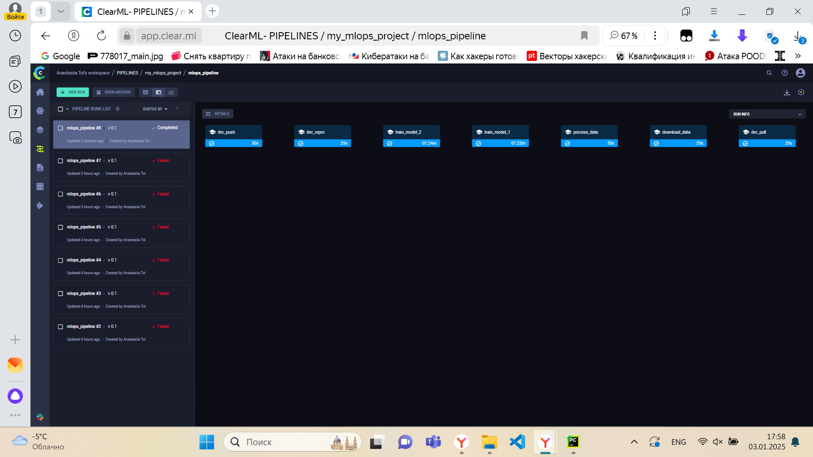

# Автоматизация экспериментов с ClearML 

### Задача: использовать ClearML для автоматизации процессов, создания и запуска пайплайнов.

### Настройка ClearML:
Настройте ClearML сервер и интеграцию с проектом.
Убедитесь, что все эксперименты логируются и доступны через веб-интерфейс.

### Создание и запуск пайплайнов:
Создайте автоматизированный пайплайн для запуска экспериментов и обработки данных.
Запустите пайплайн через ClearML и убедитесь, что все шаги корректно выполняются.

### Сравнение моделей:
Используйте ClearML для сравнения результатов экспериментов и моделей.
Составьте отчет с выводами.

### Отчет и визуализация:
Создайте отчет, содержащий визуализацию экспериментов и моделей, а также анализ результатов.

Результат:

